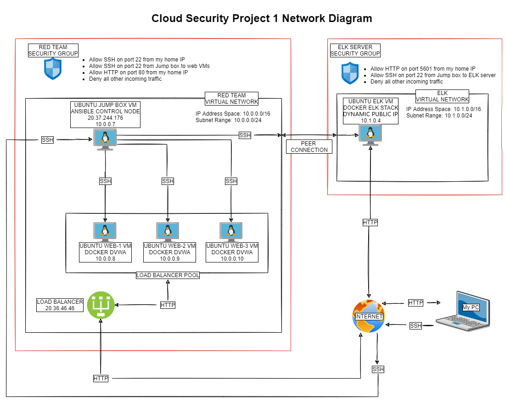
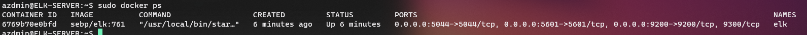
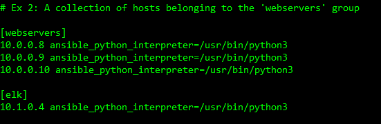
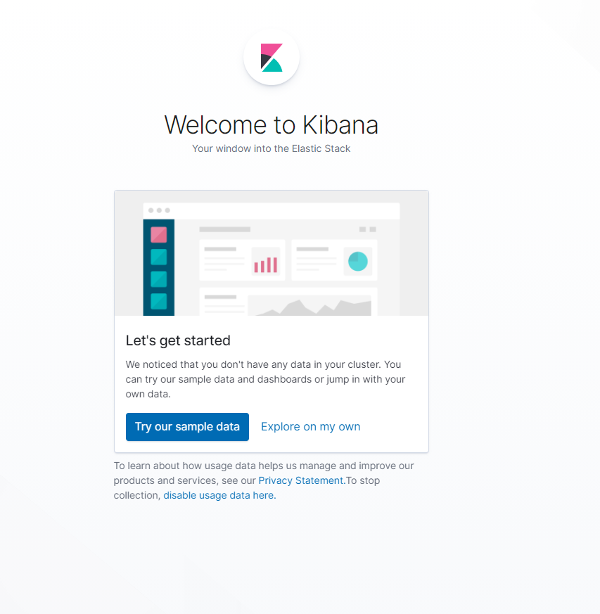

# UWA Cyber Security Bootcamp Projects
This repository contains a collection of work completed in the UWA Cyber Security Bootcamp.

The linux directory contains a collection of bash scripts written to perform various tasks on linux operating systems.

The diagrams directory contains a collection of network diagrams made throughout the course.

The git directory documents the process of creating this repository.

The ansible directory contains details on an Azure cloud deployment created during the class. This is the bulk of the work featured here. The README for the Azure deployment follows:

# Automated ELK Stack Deployment

The files in the ansible directory of this repository were used to configure the network depicted below.



These files have been tested and used to generate a live ELK deployment on Azure. They can be used to recreate the entire deployment pictured above. Alternatively, select playbook files may be used to install only certain pieces of it, such as Filebeat.

  - [pentest.yml](ansible/playbooks/pentest.yml) - for setting up the DVWA web VM's.
  - [install-elk.yml](ansible/playbooks/install-elk.yml) - for setting up the ELK server.
  - [filebeat-playbook.yml](ansible/playbooks/filebeat-playbook.yml) - for installing filebeat.
  - [metricbeat-playbook.yml](ansible/playbooks/metricbeat-playbook.yml) - for installing metricbeat.

### This document contains the following details:
- Description of the Topology
- Access Policies
- ELK Configuration
  - Beats in Use
  - Machines Being Monitored
- How to Use the Ansible Build


### Description of the Topology

The main purpose of this network is to expose a load-balanced and monitored instance of DVWA, the Damn Vulnerable Web Application.

Load balancing ensures that the application will be highly available, in addition to restricting access to the network.
- Load balancers protect an application's availability, by providing access to multiple endpoints, traffic can be redirected to another server if one is down or inundated. This can help to lessen the risk of DoS attacks.
- The advantage of using a Jump Box is it provides a single point of entry for system admins to configure and maintain the network.

Integrating an ELK server allows users to easily monitor the vulnerable VMs for changes to the file system and system metrics.
- Filebeat watches for changes to the file system.
- Metricbeat records system metrics, such as CPU or memory data related to the services runing on the machine.

### The configuration details of each machine can be found below.

| Name       | Function    | Private IP Address | Public IP Address             | Operating System |
|------------|-------------|--------------------|-------------------------------|------------------|
| Jump-Box   | Gateway     | 10.0.0.7           | 20.37.244.176                 | Linux - Ubuntu   |
| Web-1      | DVWA server | 10.0.0.8           |                               | Linux - Ubuntu   |
| Web-2      | DVWA server | 10.0.0.9           |                               | Linux - Ubuntu   |
| Web-3      | DVWA server | 10.0.0.10          |                               | Linux - Ubuntu   |
| ELK-Server | ELK server  | 10.1.0.4           |                               | Linux - Ubuntu   | 

### Access Policies

The machines on the internal network are not exposed to the public Internet. 

Only the Jump Box machine can accept connections from the Internet. Access to this machine is only allowed from the following IP addresses:
- My home IP

Machines within the network can only be accessed by SSH.
- The Jump Box machine (10.0.0.7) is used to access the ELK Server.

A summary of the access policies in place can be found in the table below.

| Name       | Publicly Accessible | Allowed IP Addresses |
|------------|---------------------|----------------------|
| Jump-Box   | No                  | My home IP      	  |
| Web-1      | No                  | 10.0.0.7             |
| Web-2      | No                  | 10.0.0.7             |
| Web-3      | No                  | 10.0.0.7             |
| ELK-server | No                  | 10.0.0.7             |

### Elk Configuration

Ansible was used to automate configuration of the ELK machine. No configuration was performed manually, which is advantageous because...
- The main advantage of automating configuration with Ansible is that plays can be run on any number of machines, always acheiving the exact same result. It removes the potential for human error and greatly speeds up the task of configuring of multiple machines.

The ELK playbook implements the following tasks:
- install docker
- install python 3 pip
- install the python docker module with pip
- configure VM to allow more memory usage
- download and launch a docker ELK container image
- ensure docker is started on VM boot

The following screenshot displays the result of running `docker ps` after successfully configuring the ELK instance.



### Target Machines & Beats
This ELK server is configured to monitor the following machines:
- Web-1: 10.0.0.8
- Web-2: 10.0.0.9
- Web-3: 10.0.0.10

We have installed the following Beats on these machines:
- Filebeat
- Metricbeat

These Beats allow us to collect the following information from each machine:
- Filebeat monitors system log files, specifically the logs kept in the /var/log/ directory. An example is auth.log - these logs track the authorisation systems, including authentication failures, sudo logins, ssh logins, and other errors logged by the system security services daemon.
- Metricbeat collects metrics from the operating system and services running on the server. Some example metrics are CPU usage, memory usage, and inbound/outbound traffic.

### Using the ELK, Filebeat, and Metricbeat Playbooks
In order to use the playbook, you will need to have an Ansible control node already configured. Assuming you have such a control node provisioned: 

SSH into your control node and follow the steps below:

Copy the [install-elk.yml](ansible/playbooks/install-elk.yml), [filebeat-playbook.yml](ansible/playbooks/filebeat-playbook.yml), and [metricbeat-playbook.yml](ansible/playbooks/metricbeat-playbook.yml) install files to `/etc/ansible/roles/` - you may need to add this directory. The following commands should download the files to the specified directories:

```
curl https:/gist.githubusercontent.com/chrisdurkan/a10e5fcba51c0c129ea9aa2a023fd98f/raw/3842d960ee9a3f9631574675180ec4611a80736a/install-elk.yml > /etc/ansible/roles/install-elk.yml
```

```
curl https:/gist.githubusercontent.com/chrisdurkan/64077298082bc8e2d4a9773b68fd8e6e/raw/8723d4550dc4a42e334cedadb271eb8c8fa1f232/filebeat-playbook.yml > /etc/ansible/roles/filebeat-playbook.yml
```

```
curl https:/gist.githubusercontent.com/chrisdurkan/09e7f2ee94c9db8149e0db78146f8080/raw/ad30ccb16220efbd5425aa3ec12d193cc366a761/metricbeat-playbook.yml > /etc/ansible/roles/metricbeat-playbook.yml
```

Copy the [filebeat-config.yml](ansible/files/filebeat-config.yml) and [metricbeat-config.yml](ansible/files/metricbeat-config.yml) files to `/etc/ansible/files/` - you may need to create this directory too. The following commands should download the files to the specified directories:

```
curl https:/gist.githubusercontent.com/chrisdurkan/a25226e065b8ca447a18ef09659ebbe3/raw/580d41138b5bb8c92faf4693deaeeaf0c412b702/filebeat-config.yml > /etc/ansible/files/filebeat-config.yml
```

```
curl https:/gist.githubusercontent.com/chrisdurkan/1a9074b253989bdf2ab199d9a8da28c2/raw/4fcd1a94a0f75b92c3832aaca4b6eac4a1a247bf/metricbeat-config.yml > /etc/ansible/files/metricbeat-config.yml
```

Update the `filebeat-config.yml` file on lines #1105 and #1805 to use the private IP address for your ELK server. 

Update the `metricbeat-config.yml` file on lines #62 and #95 to use the private IP address for your ELK server.

Update the `/etc/ansible/hosts` file to include the `[elk]` host group, under this host group add your ELK server's private IP address and `ansible_python_interpreter=/usr/bin/python3` to specify python 3 as the interpreter. Also add a host group for `[webservers]` and add the private IP's for your webservers to be monitored, followed by `ansible_python_interpreter=/usr/bin/python3`. 

For example: 




Run the playbooks, and navigate to `http:/[your.VM.IP]:5601/app/kibana` in your favourite browser to check that the installation worked as expected. You should see this if all went well: 



Alternatively you can SSH into the ELK VM and run `curl localhost:5601/app/kibana` to check the output. If you see HTML you're good!


